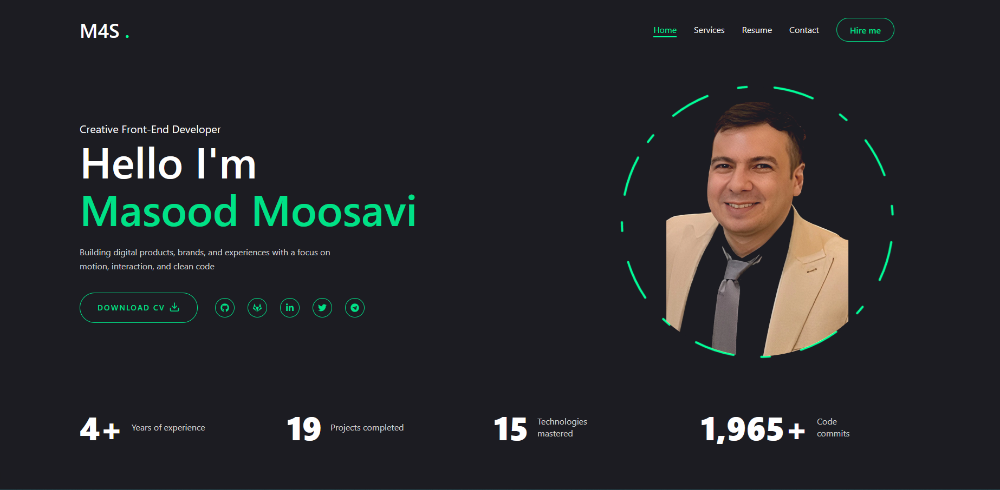

# 🚀 Masood Moosavi | Creative Developer Portfolio

A high-performance, visually stunning, and interactive developer portfolio. Built with the latest web technologies to showcase projects, technical skills, and professional experience. Designed with a **Dark Mode Only** aesthetic, focusing on clean code, smooth animations, and best practices.

## ✨ Key Features

- **⚡ Next.js 16 (App Router):** Utilizing Server Components for lightning-fast performance and SEO.
- **🎨 Tailwind CSS v4:** Using the latest engine for zero-runtime styling and custom themes.
- **🎬 Framer Motion:** Advanced page transitions (Stair Effect) and micro-interactions.
- **📱 Fully Responsive:** Optimized layout for Mobile, Tablet, and Desktop devices.
- **🧩 Component Architecture:** Modular structure using Shadcn UI and atomic design principles.
- **🌑 Cyberpunk/Dark Aesthetic:** A professional dark theme with neon green accents.
- **🔍 SEO Optimized:** Integrated Metadata and Open Graph support for better visibility.
- **✉️ Functional Contact Form:** Ready for API integration.

## 🛠️ Tech Stack

- **Framework:** [Next.js 16](https://nextjs.org/)
- **Language:** [TypeScript](https://www.typescriptlang.org/)
- **Styling:** [Tailwind CSS](https://tailwindcss.com/)
- **UI Library:** [Shadcn UI](https://ui.shadcn.com/)
- **Animations:** [Framer Motion](https://www.framer.com/motion/)
- **Icons:** [Lucide React](https://lucide.dev/) & [React Icons](https://react-icons.github.io/react-icons/)
- **Font:** [JetBrains Mono](https://fonts.google.com/specimen/JetBrains+Mono)

## 🚀 Getting Started

Follow these steps to run the project locally on your machine:

### 1. Clone the repository

    git clone [https://github.com/YOUR_USERNAME/portfolio-v2.git](https://github.com/YOUR_USERNAME/portfolio-v2.git)
    cd portfolio-v2

### 2. Install dependencies

    npm install
    # or if you use yarn/pnpm
    yarn install
    pnpm install

### 3. Run the development server

    npm run dev

Open [http://localhost:3000](http://localhost:3000) with your browser to see the result.

## 📂 Project Structure

This project follows a clean, feature-based architecture with Tailwind v4 (No config file):

    ├── public/              # Static assets (images, resume.pdf)
    ├── src/
    │   ├── app/             # Next.js App Router pages (Home, Resume, Work, Contact)
    │   ├── components/      # React Components
    │   │   ├── home/        # Homepage specific components
    │   │   ├── layout/      # Layout components (Header, Nav, Transitions)
    │   │   └── ui/          # Reusable UI elements (Shadcn)
    │   ├── constants/       # Static data (Nav links, Socials)
    │   ├── lib/             # Utility functions
    │   └── types/           # TypeScript definitions
    ├── postcss.config.mjs   # PostCSS configuration
    ├── next.config.ts       # Next.js configuration
    └── ...

## 🎨 Customization Guide

### Personal Information

To update your name, title, and bio, edit the following files:

- `src/components/home/Hero.tsx`
- `src/components/home/Stats.tsx`

### Resume / CV

Replace the existing PDF file located at:

- `public/assets/resume.pdf`

### Color Scheme

The project uses CSS variables for theming. You can adjust the primary and accent colors in:

- `src/app/globals.css` (Look for `--primary` and `--accent`)

## 📦 Deployment

The easiest way to deploy your Next.js app is to use the [Vercel Platform](https://vercel.com/new?utm_medium=default-template&filter=next.js&utm_source=create-next-app&utm_campaign=create-next-app-readme).

1. Push your code to a GitHub repository.
2. Import the project into Vercel.
3. Vercel will automatically detect Next.js and deploy.

## 📄 License

This project is open source and available under the [MIT License](LICENSE).

---

**Developed by [Masood Moosavi](https://github.com/M4SooD)**
