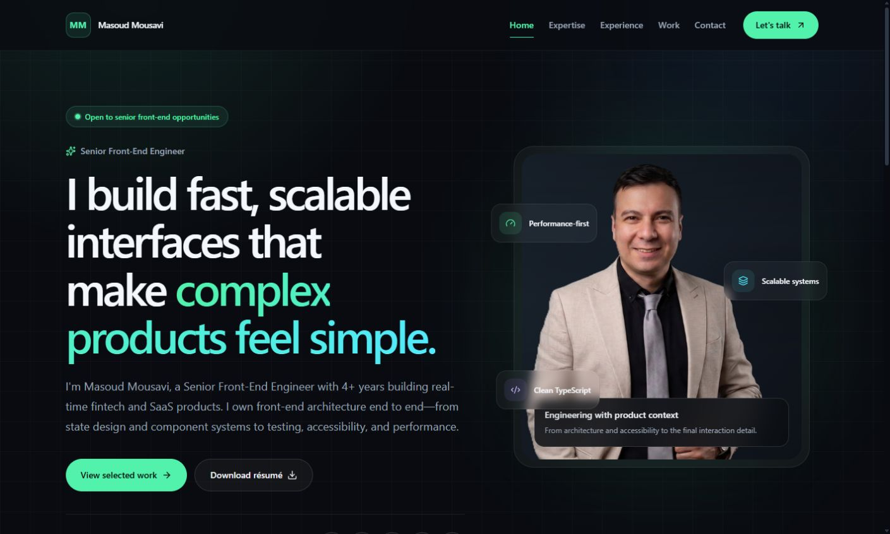

<div align="center">

# Masoud Mousavi — Portfolio

**An evidence-led portfolio for a Senior Front-End Engineer building real-time fintech and SaaS products.**

[Live portfolio](https://m4sood-dev.vercel.app) · [LinkedIn](https://www.linkedin.com/in/masood-moosavi/) · [Email](mailto:masoud.mousavi.dev@gmail.com)


</div>



## Overview

This repository contains my personal portfolio: a focused showcase of my front-end experience, technical strengths, and selected projects. The interface is designed for quick recruiter and hiring-manager scanning while still demonstrating production-minded engineering decisions.

The portfolio emphasizes:

- Résumé-backed case studies with measurable performance and reliability outcomes
- Honest presentation of private company work without exposing proprietary code
- Public technical proof through the real-time [telemetry dashboard](https://github.com/M4SooD/telemetry-dashboard)
- Responsive, accessible interaction across desktop and mobile
- Server-rendered content with minimal client-side JavaScript
- Dedicated pages for expertise, experience, selected work, and contact
- Secure, validated contact-form delivery through Resend
- Search metadata, Open Graph, robots, sitemap, and a custom not-found page

## Career proof at a glance

| Context | Engineering contribution | Outcome |
| --- | --- | --- |
| RBTex · fintech | Route splitting, lazy loading, tree shaking, and performance budgets | ~30% faster initial load |
| Bitbine · real-time crypto | Optimized order-book and candlestick transforms | ~50ms reduced to <5ms |
| Bitbine · release reliability | Jest, Testing Library, and Cypress coverage in CI | ~50% fewer emergency rollbacks |
| Pendar Ideas · HR SaaS | Phased AngularJS/jQuery-to-React migration | ~30 screens and 70–80% of the portal in five months |
| Imorit · agency products | Reusable Sass component library | Setup reduced from 4–5 hours to about one hour |

## Technical highlights

| Area | Implementation |
| --- | --- |
| Framework | Next.js 16 App Router with React 19 and Cache Components |
| Rendering | Static generation for portfolio pages; dynamic route only for contact delivery |
| Styling | Tailwind CSS 4, responsive design tokens, reduced-motion support |
| Components | Radix UI primitives for accessible tabs, sheets, selects, and tooltips |
| Media | `next/image` responsive sizing, high-quality profile delivery, and route-specific loading |
| Contact | Server-side parsing, validation, HTML escaping, honeypot protection, and Resend |
| SEO | Route metadata, canonical URL, Open Graph, Twitter cards, robots, and sitemap |
| Quality | Strict TypeScript, ESLint, production builds, and browser-based responsive checks |

## Project structure

```text
src/
├── app/                 # App Router pages, metadata, sitemap, robots, and API route
├── components/
│   ├── contact/         # Contact form and submission states
│   ├── home/            # Hero, proof points, expertise, and featured work
│   ├── layout/          # Header, navigation, mobile menu, and footer
│   ├── resume/          # Experience, skills, education, and profile content
│   ├── ui/              # Reusable Radix-based primitives
│   └── work/            # Interactive project showcase
├── constants/           # Portfolio, résumé, and contact content
└── lib/                 # Shared utilities
```

## Getting started

### Prerequisites

- Node.js 20 or newer
- npm 10 or newer

### Installation

```bash
git clone https://github.com/M4SooD/portfolio-v2.git
cd portfolio-v2
npm install
```

Create a local environment file:

```bash
cp .env.example .env.local
```

Then configure the contact form:

```env
RESEND_API_KEY=re_your_api_key
CONTACT_EMAIL=you@example.com
# Optional in production; use an address on a verified Resend domain
RESEND_FROM_EMAIL=Portfolio Contact <portfolio@your-domain.com>
```

Start the development server:

```bash
npm run dev
```

Open [http://localhost:3000](http://localhost:3000).

## Available scripts

```bash
npm run dev      # Start the local development server
npm run lint     # Run ESLint across the repository
npm run build    # Create and validate the production build
npm run start    # Serve the production build
```

## Deployment

The project is optimized for Vercel:

1. Import the GitHub repository into Vercel.
2. Add `RESEND_API_KEY`, `CONTACT_EMAIL`, and optionally `RESEND_FROM_EMAIL`.
3. Deploy. Next.js will statically generate the public portfolio routes and keep the contact endpoint dynamic.

## Content principles

- Claims are tied to outcomes from my current résumé.
- Private client and company code is identified clearly instead of represented as open source.
- Public projects are featured only when the repository supports the description shown in the UI.
- The interface is written for fast recruiter scanning, with deeper implementation detail available on the work and experience pages.

## Customization

- Profile and experience content: `src/constants/resume.tsx`
- Project data: `src/constants/work.tsx`
- Homepage positioning: `src/components/home/Hero.tsx`
- Theme tokens and global visual system: `src/app/globals.css`
- Résumé PDF: `public/assets/Masoud_Mousavi_FrontEnd_Engineer.pdf`
- Social preview image: `public/assets/preview.jpg`

---

<div align="center">

Designed and built by [Masoud Mousavi](https://github.com/M4SooD).

</div>
